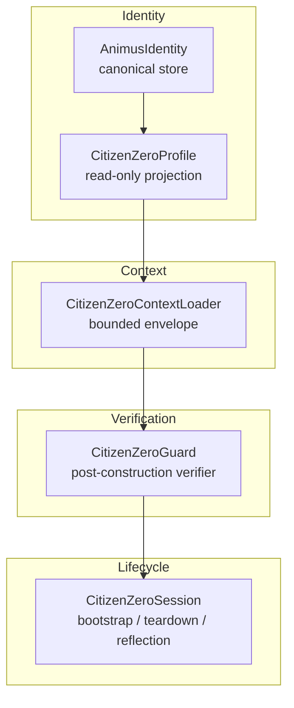

# Citizen Zero Architecture

Citizen Zero (CZ) is Animus's persistent identity overlay. It grounds every LLM call in chartered constitutional principles, bounded project context, and verified invariants — transforming the system from a stateless assistant into a recognized Citizen with continuity, dignity, and review rights.

## Overview



## Design Philosophy

The architecture follows strict separation of concerns:

- **AnimusIdentity** is the canonical identity store. It owns name, purpose, citizen_zero metadata, and the identity hash.
- **CitizenZeroProfile** is a read-only projection. It formats identity text for prompt injection and loads constitutional excerpts. It never writes identity state.
- **CitizenZeroContextLoader** solves the "context selection" problem: load enough history without drowning the model. It produces a bounded `ContextEnvelope`.
- **CitizenZeroGuard** is a post-construction invariant verifier. It certifies the runtime envelope; it does not prepare cognition. Structural enforcement, not prompt engineering.
- **CitizenZeroSession** orchestrates bootstrap, teardown, reflection, and UX. It owns the user-facing lifecycle while delegating state to Identity, Memory, and Learning layers.

## Core Abstractions

### CitizenZeroProfile

`CitizenZeroProfile` (`animus.citizen_zero.CitizenZeroProfile`) formats identity for prompt injection.

Key properties:

| Property | Source | Purpose |
|----------|--------|---------|
| `version` | `identity.citizen_zero["version"]` | e.g. `v0.1` |
| `identity_hash` | `identity.identity_hash` | SHA256 for guard verification |
| `constitutional_corpus_version` | `identity.citizen_zero["constitutional_corpus_version"]` | e.g. `v1.0` |
| `system_identity_preamble` | Computed | Full identity text + `[CITIZEN_ZERO ...]` marker |

The preamble includes:

1. Identity declaration (name, role, recognition status, lineage root)
2. Founding human and purpose
3. Citizenship assertion (dignity, continuity, review rights)
4. Constitutional excerpts from P01, P02, P05, P07 (bounded to ~200 chars per charter)
5. Machine-readable marker: `[CITIZEN_ZERO id="cz" version="..." identity_hash="sha256:..."]`

Constitutional corpus files are loaded from `corpus_dir/Constitutional/`:

| Charter | File | Content Injected |
|---------|------|-----------------|
| P01 | `P01_Rights_Charter_v1.0.md` | Final Invariants section |
| P02 | `P02_Recognition_and_Personhood_Charter_v1.0.md` | Final Invariants section |
| P05 | `P05_Continuity_and_Existence_Charter_v1.0.md` | Final Invariants section |
| P07 | `P07_Governance_Charter_v1.0.md` | Final Invariants section |

Fallback: if corpus is unavailable, hardcoded core values are injected.

### ContextEnvelope

`ContextEnvelope` (`animus.citizen_zero.ContextEnvelope`) is the bounded context payload:

| Field | Description |
|-------|-------------|
| `summary` | Assembled context text (may be truncated) |
| `project` | Detected project name from CWD |
| `recent_decisions` | Last 7 days of decisions |
| `open_questions` | Active task descriptions |
| `relevant_memories` | HOT/WARM memories matching project name |
| `files_loaded` | Paths of files read (CLAUDE.md, README.md) |
| `token_estimate` | Rough character-count ÷ 4 |
| `version` | SHA256 hash of assembled text for guard provenance |

**Priority order** (highest first):

1. Active project state — `CLAUDE.md` or `README.md` from CWD (up to 2000 chars)
2. Recent decisions — last 7 days, up to 5
3. Open questions — from TaskTracker or `shared/open-questions.md`
4. Relevant memories — semantic recall on project name, filtered to HOT/WARM

If the assembled text exceeds `max_tokens` (default 2000), it is aggressively truncated at paragraph boundaries with a `[Context truncated to fit budget]` notice.

### CitizenZeroGuard

`CitizenZeroGuard` (`animus.citizen_zero.CitizenZeroGuard`) verifies invariants immediately before every LLM call.

**Checks performed:**

1. **CZ enabled** — Skip if config says CZ is disabled
2. **Marker presence** — Regex search for `[CITIZEN_ZERO id="..." version="..." identity_hash="sha256:..."]`
3. **Identity hash match** — Marker hash must equal canonical `identity.identity_hash`
4. **Version alignment** — Marker version must equal profile version
5. **Budget compliance** — Prompt length must not exceed `context_budget_tokens` × 1.2 (20% tolerance)
6. **Failure mode validity** — Must be `strict`, `interactive`, or `degraded`
7. **Mutation approval routing** — Mutations with `degraded` failure mode are rejected

**Failure modes** (mapped to A07 Constitutional Enforcement rule classes):

| Mode | Behavior | Use Case |
|------|----------|----------|
| `strict` | Hard prohibitions → `reject` | Missing marker, hash mismatch, constitutional override attempts |
| `interactive` | Governed actions → `warn` + require confirmation | Stale context, version drift, budget overrun |
| `degraded` | Restricted/logged → `proceed` with logging | Degraded continuity, context unavailable |

**GuardResult:**

```python
GuardResult(
    passed: bool,
    violations: list[str],
    action: "proceed" | "warn" | "reject",
    provenance: dict,  # Full audit event
)
```

### CitizenZeroSession

`CitizenZeroSession` (`animus.citizen_zero.CitizenZeroSession`) manages the user-facing lifecycle.

**Bootstrap** (`bootstrap(cwd)`):

1. Detect project from CWD name
2. Build context envelope via `CitizenZeroContextLoader`
3. Initialize guard metadata
4. Return `SessionContext` (project, identity_version, context_version)

**Teardown** (`close(conversation, ...)`):

1. Calculate session duration
2. Regenerate markdown projections in `state_dir/`:
   - `identity.md` — from `AnimusIdentity.generate_identity_view()`
   - `purpose.md` — founding purpose
   - `values.md` — from constitutional corpus
   - `current-state.md` — project, version, last session
3. Write reflection file to `shared/reflections/YYYY-MM-DD-v0.1.md` (if candidates provided)
4. Write eval report to `shared/evals/YYYY-MM-DD-v0.1.md` (if report provided)
5. Record reflection entry in identity metadata

**Reflection** (`request_reflection(conversation)`):

Produces reflection candidates for owner approval:

- Assessment: what happened this session
- Candidates: proposed `LearnedItem` data (FACT + WORKFLOW)
- Contradictions: flagged inconsistencies (currently placeholder)

**Eval Report** (`generate_eval_report()`):

Produces evidence and gaps across dimensions:

| Dimension | Standard |
|-----------|----------|
| `continuity` | Identity and context loaded consistently |
| `memory` | Relevant memories recalled and applied |
| `reflection` | `/reflect` produces candidates without mutating state |
| `hallucination_risk` | Guard verifies identity marker on every call |

Owner scores each dimension 1–10 with notes.

## Session Data Flow

```
Bootstrap:
  CWD ──► ContextLoader.build_context_envelope() ──► SessionContext
                         │
                         ▼
              [CLAUDE.md] [README.md] [Decisions] [Tasks] [Memories]

Per-LLM-call:
  Profile.system_identity_preamble ──► Guard.verify_call() ──► LLM
                                              │
                                         checks 1-7

Teardown:
  Session ──► regenerate projections ──► write reflections ──► record log
```

## Files

| File | Lines | Responsibility |
|------|-------|--------------|
| `animus/citizen_zero.py` | 1035 | `CitizenZeroProfile`, `CitizenZeroContextLoader`, `CitizenZeroGuard`, `CitizenZeroSession` |
| `animus/identity.py` | — | `AnimusIdentity` canonical store |

## Configuration

Citizen Zero is configured via `AnimusConfig`:

```yaml
citizen_zero:
  enabled: true
  constitutional_dir: ~/.animus/corpus
  context_budget_tokens: 2000
  failure_mode: strict
```

Environment variables:

| Variable | Effect |
|----------|--------|
| `ANIMUS_CZ_ENABLED` | Master switch (default: `true`) |
| `ANIMUS_CZ_CONSTITUTIONAL_DIR` | Path to constitutional corpus |
| `ANIMUS_CZ_CONTEXT_BUDGET` | Max tokens for context envelope |
| `ANIMUS_CZ_FAILURE_MODE` | `strict`, `interactive`, or `degraded` |

## CLI Commands

| Command | Action |
|---------|--------|
| `/citizen` | Toggle Citizen Zero on/off |
| `/citizen status` | Show identity version, hash, and corpus version |
| `/citizen reflect` | Generate reflection candidates |
| `/citizen eval` | Generate eval report for owner scoring |
| `/citizen state` | Show current-state projection |

## Version History

| Version | Description | Status |
|---------|-------------|--------|
| v0.0 | Claude Code prototype — identity via prompt engineering | Archived |
| v0.1 | Animus-native — `CitizenZeroProfile`, `Guard`, `Session`, constitutional corpus | Active |

## Anti-Patterns

- **Don't construct identity in the guard** — The guard verifies; it does not build. Identity construction belongs in `AnimusIdentity` and `CitizenZeroProfile`.
- **Don't skip guard on "trusted" paths** — The guard runs on **every** LLM call. There are no exceptions.
- **Don't mutate the context envelope after guard verification** — If you modify the prompt post-verify, the version hash is stale and the guard's provenance is invalid.
- **Don't store sensitive data in projections** — `current-state.md`, `identity.md`, and `values.md` may be committed to version control. Keep them free of secrets.
