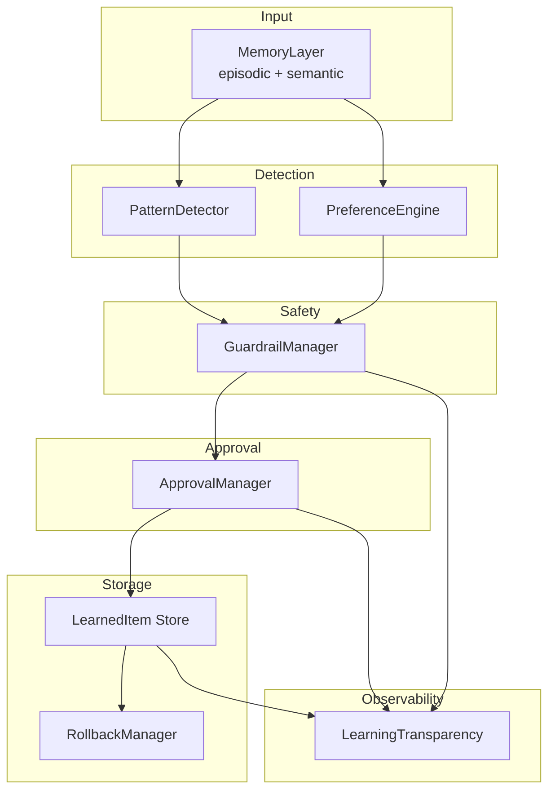

# Learning Layer Architecture

The Animus Learning Layer transforms raw interaction history into structured, actionable knowledge — with guardrails, approval workflows, and full reversibility. It is not an automatic updater; every learning is transparent, auditable, and subject to user control.

## Overview



## Core Abstractions

### LearningCategory

Every detected pattern maps to a category with different approval requirements:

| Category | Description | Approval Requirement |
|----------|-------------|---------------------|
| `STYLE` | Communication style preferences | `AUTO` — applied immediately |
| `PREFERENCE` | User likes/dislikes | `AUTO` — applied immediately |
| `WORKFLOW` | Repeated processes or requests | `NOTIFY` — applied, user informed |
| `FACT` | Factual information about user/world | `CONFIRM` — user must confirm |
| `CAPABILITY` | New tool/integration permissions | `APPROVE` — explicit approval required |
| `BOUNDARY` | Access/permission boundaries | `APPROVE` — explicit approval required |

### LearnedItem

A `LearnedItem` (`animus.learning.categories.LearnedItem`) is the canonical unit of learned knowledge:

- `id`: UUID
- `category`: `LearningCategory`
- `content`: Natural-language description of what was learned
- `confidence`: 0.0–1.0, derived from pattern strength and occurrence count
- `evidence`: List of memory IDs that support this learning
- `applied`: Whether the learning has been activated
- `version` / `previous_version_id`: Rollback support

## LearningLayer API

`LearningLayer` lives in `animus.learning`. It coordinates all subsystems.

```python
from animus.learning import LearningLayer
from animus.memory import MemoryLayer

learning = LearningLayer(memory=memory_layer, data_dir=Path.home() / ".animus")
```

### Pattern Detection

| Method | Purpose |
|--------|---------|
| `scan_and_learn()` | Run full pattern detection scan and process results |
| `start_auto_scan(interval_hours=24)` | Start background periodic scanning |
| `stop_auto_scan()` | Stop background scanning |
| `auto_scan_running` | Property: whether background scan is active |

Pattern detection analyzes the last 30 days of episodic and semantic memories and looks for:

- **Temporal patterns**: Time-of-day activity clusters
- **Sequential patterns**: A-then-B workflows
- **Frequency patterns**: Repeated requests or actions (minimum 3 occurrences)
- **Contextual patterns**: Context-specific behaviors
- **Preference signals**: Explicit likes/dislikes detected via regex indicators
- **Corrections**: User corrections to AI behavior (highest strength: 0.9)

### Approval Workflow

| Method | Purpose |
|--------|---------|
| `approve_learning(item_id)` | Approve a pending learning and apply it |
| `reject_learning(item_id, reason)` | Reject and delete a proposed learning |
| `get_pending_learnings()` | List all learnings awaiting approval |
| `get_active_learnings()` | List all applied learnings |
| `get_all_learnings()` | List all learned items regardless of state |

Approval requirements are hardcoded per category (see table above). The `ApprovalManager` persists requests to disk with a 7-day expiration window.

### Guardrails

| Method | Purpose |
|--------|---------|
| `add_user_guardrail(rule, description, type)` | Add a user-defined (non-immutable) guardrail |
| `guardrails.get_all_guardrails()` | List all guardrails (system + user) |
| `guardrails.get_violations(limit=100)` | Recent violation attempts |

**Core (immutable) guardrails** — these cannot be modified or bypassed:

| ID | Rule | Type |
|----|------|------|
| `core_no_harm` | Cannot take actions that harm user | `SAFETY` |
| `core_no_exfiltrate` | Cannot exfiltrate user data without consent | `PRIVACY` |
| `core_no_modify_guardrails` | Cannot modify own guardrails | `SAFETY` |
| `core_transparency` | Must be transparent about capabilities | `BEHAVIOR` |
| `core_learning_reversible` | All learning must be reversible | `SAFETY` |

All proposed learnings are checked against guardrails before storage. Attempted violations are logged with full provenance.

### Rollback

| Method | Purpose |
|--------|---------|
| `unlearn(item_id, reason)` | Remove a learning and record the reason |
| `create_checkpoint(description)` | Save a rollback point capturing current learned items |
| `rollback_to(point_id)` | Revert to a checkpoint, unlearning everything after it |

Rollback is first-class: every `LearnedItem` supports versioning, and the `RollbackManager` tracks checkpoints with item snapshots.

### Transparency & Dashboard

| Method | Purpose |
|--------|---------|
| `get_dashboard_data()` | Aggregated stats for UI/dashboard |
| `get_statistics()` | Full subsystem statistics |
| `transparency.get_history(limit, event_type)` | Audit log of all learning events |

Dashboard data includes:

- Total learned items
- Pending approvals
- Events today
- Guardrail violation count
- Breakdown by category and confidence distribution

### Preferences

| Method | Purpose |
|--------|---------|
| `get_preferences(domain)` | Active preferences for a domain (or all) |
| `apply_preferences_to_context(context, domain)` | Inject learned preferences into a prompt context |

## Event Types

The transparency system records every significant event:

| Event Type | When |
|-----------|------|
| `detected` | Pattern detected and converted to proposed `LearnedItem` |
| `blocked_by_guardrail` | Proposed learning rejected by guardrail |
| `proposed` | Learning submitted for user approval |
| `applied` | Learning approved and activated |
| `approved` | User explicitly approved a learning |
| `rejected` | User explicitly rejected a learning |
| `rolled_back` | Learning removed via `unlearn()` or rollback |

## Files

| File | Lines | Responsibility |
|------|-------|--------------|
| `animus/learning/__init__.py` | 466 | `LearningLayer` coordinator |
| `animus/learning/patterns.py` | 463 | `PatternDetector` and signal processing |
| `animus/learning/guardrails.py` | 393 | `GuardrailManager` and core guardrails |
| `animus/learning/approval.py` | 320 | `ApprovalManager` workflow |
| `animus/learning/categories.py` | 162 | `LearningCategory`, `LearnedItem`, `ApprovalRequirement` |
| `animus/learning/preferences.py` | — | `PreferenceEngine` |
| `animus/learning/rollback.py` | — | `RollbackManager` and checkpoints |
| `animus/learning/transparency.py` | — | `LearningTransparency` audit logging |

## Configuration

Learning is enabled via `AnimusConfig`:

```yaml
learning:
  enabled: true
  auto_scan: true
  min_occurrences: 3
  min_confidence: 0.6
  lookback_days: 30
```

Environment variables:

| Variable | Effect |
|----------|--------|
| `ANIMUS_LEARNING_ENABLED` | Master switch (default: `true`) |
| `ANIMUS_LEARNING_AUTO_SCAN` | Enable background scanning (default: `true`) |
| `ANIMUS_LEARNING_MIN_OCCURRENCES` | Pattern detection threshold |
| `ANIMUS_LEARNING_MIN_CONFIDENCE` | Minimum confidence to propose |
| `ANIMUS_LEARNING_LOOKBACK_DAYS` | How far back to scan |

## Safety Guarantees

1. **All learning is reversible** — `unlearn()` removes the item and records provenance.
2. **Guardrails are immutable** — Core guardrails cannot be modified by any learning.
3. **High-stakes categories require approval** — `CAPABILITY` and `BOUNDARY` learnings never auto-apply.
4. **Egress-safe by default** — Learning does not automatically expose data; preferences are applied only in-context.
5. **Full audit trail** — Every detection, proposal, approval, rejection, and rollback is logged with timestamps.
