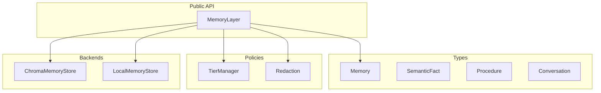

# Memory Layer Architecture

The Animus memory layer is a pluggable, multi-tiered storage system that coordinates between different memory types, backends, and retention policies. It is the canonical store for everything Animus knows.

## Overview



## Core Abstractions

### Memory

The `Memory` dataclass (`animus.memory.types.Memory`) is the canonical unit of storage. Every memory carries structured metadata that supports retrieval, filtering, versioning, and security.

| Field | Type | Default | Description |
|-------|------|---------|-------------|
| `id` | `str` | UUIDv4 | Unique identifier |
| `content` | `str` | — | Primary text payload |
| `memory_type` | `MemoryType` | `SEMANTIC` | Episodic, semantic, procedural, or active |
| `created_at` | `datetime` | `now()` | Creation timestamp |
| `updated_at` | `datetime` | `now()` | Last modification |
| `metadata` | `dict` | `{}` | Arbitrary key/value data |
| `tags` | `list[str]` | `[]` | Normalized lowercase tags |
| `source` | `str` | `"stated"` | `stated`, `inferred`, or `learned` |
| `confidence` | `float` | `1.0` | 0.0–1.0 certainty |
| `subtype` | `str \| None` | `None` | e.g. `conversation`, `fact`, `workflow` |
| `version` | `int` | `1` | Version number for history tracking |
| `parent_id` | `str \| None` | `None` | Previous version's memory ID |
| `change_summary` | `str \| None` | `None` | Human-readable delta description |
| `provenance` | `str` | `"direct"` | `direct`, `sync`, `consolidation`, `import`, `mcp` |
| `sensitivity` | `Sensitivity` | `PUBLIC` | Disclosure tier (see Security) |
| `tier` | `MemoryTier` | `WARM` | Temperature-based retention tier |
| `access_count` | `int` | `0` | Times recalled |
| `last_accessed` | `datetime \| None` | `None` | Last retrieval timestamp |

### Memory Types

| Enum | Purpose | Typical Subtype |
|------|---------|-----------------|
| `EPISODIC` | What happened (conversations, events) | `conversation` |
| `SEMANTIC` | What you know (facts, preferences) | `fact`, `preference` |
| `PROCEDURAL` | How you do things (workflows, patterns) | `workflow` |
| `ACTIVE` | Current live context | — |

## MemoryLayer API

`MemoryLayer` lives in `animus.memory.layer`. It is initialized with a `data_dir` and optional backend choice.

```python
from animus.memory import MemoryLayer
from pathlib import Path

memory = MemoryLayer(data_dir=Path.home() / ".animus" / "memory", backend="chroma")
```

Backends:

- **`chroma`** (default) — ChromaDB vector store with semantic search
- **`json`** (fallback) — Local JSON file store if ChromaDB is unavailable

### Storage Methods

| Method | Purpose |
|--------|---------|
| `remember(content, ...)` | Store a new memory with full metadata |
| `remember_fact(subject, predicate, obj, ...)` | Store a structured semantic fact (SPO triple) |
| `remember_procedure(name, trigger, steps, ...)` | Store a procedural workflow |
| `save_conversation(conversation)` | Persist a `Conversation` as episodic memory |

### Retrieval Methods

| Method | Purpose |
|--------|---------|
| `recall(query, ...)` | Semantic search with optional filters (type, tags, source, confidence, tier, sensitivity) |
| `recall_by_tags(tags, ...)` | Exact tag match (all must match) |
| `recall_for_egress(query, ...)` | Egress-safe recall pinned to `Sensitivity.PUBLIC` only |
| `get_memory(id)` | Exact or partial-ID lookup |
| `get_all_tags()` | All tags with usage counts |

### Lifecycle Methods

| Method | Purpose |
|--------|---------|
| `update_with_version(id, ...)` | Create a new versioned memory (immutable history) |
| `get_version_history(id, limit=10)` | Walk the `parent_id` chain |
| `promote_memory(id)` | Explicitly promote to next tier (COLD→WARM→HOT) |
| `demote_memory(id)` | Explicitly demote to previous tier |
| `run_tier_review()` | Periodic review: demote stale WARM, enforce HOT cap |
| `forget(id)` | Delete a memory and clean up entity references |

### Export / Import

| Method | Purpose |
|--------|---------|
| `snapshot(label)` | Export all memories to a timestamped JSON file in `data_dir/snapshots/` |
| `restore_snapshot(path)` | Clear current store and import from snapshot |
| `export_memories(format="json")` | Export as JSON or JSONL string |
| `import_memories(data, format="json")` | Import from JSON or JSONL string |
| `export_memories_csv()` | Export as CSV string |
| `backup(path)` | Create a `.zip` archive of the entire data directory |
| `consolidate(max_age_days=90, min_group_size=3)` | Group old episodic memories by tag and replace with summaries |

## Temperature-Based Tiering (D2)

The `TierManager` (`animus.memory.tier`) implements a temperature-based retention policy. All policy values are hardcoded in code (not config) — changes require a commit.

| Tier | Meaning | Promotion Rule |
|------|---------|--------------|
| **HOT** | Active session context, fast retrieval | WARM promoted after 3 accesses |
| **WARM** | Recently accessed, default for new memories | COLD promoted on any access; WARM demoted to COLD after 30 days idle |
| **COLD** | Archival, retrieve only on explicit request | — |

Rules:

- **HOT cap**: 50 memories max. Oldest HOT (by `last_accessed`) demotes to WARM.
- **Auto-promotion**: Every access increments `access_count`. WARM → HOT at threshold 3. COLD → WARM on any access.
- **Reranking**: `recall()` results are reordered by tier priority (HOT > WARM > COLD), then by `access_count` descending.
- **Explicit control**: `promote_memory()` and `demote_memory()` allow manual administrative overrides.

## Security: Sensitivity Tiers

The `Sensitivity` enum (re-exported from `animus_types` for backward compatibility) controls disclosure scope:

| Tier | Meaning | Default For |
|------|---------|-----------|
| `PUBLIC` | Safe to share externally | Most memories |
| `PERSONAL` | User-specific but not sensitive | Preferences, habits |
| `CONFIDENTIAL` | Business or private | Financial, health, credentials (redacted) |
| `SECRET` | Highly sensitive | Auth tokens, PII (always redacted before storage) |

Redaction (`animus.memory.redaction`) runs **before** storage. Content containing secrets is scrubbed and the scrub count is recorded in metadata.

**Egress contract**: Any surface that can send data outside the process (MCP tools, API, automation) must use `recall_for_egress()` or pass `allowed_tiers={Sensitivity.PUBLIC}`. The default `allowed_tiers=None` returns all tiers and is only safe for in-process local-owner reads (CLI, learning loop).

## Versioning

Memories are versioned immutably. `update_with_version()` creates a **new** `Memory` with:

- Incremented `version`
- `parent_id` pointing to the old memory
- `change_summary` auto-generated from what changed (content, tags, metadata)

The old memory remains in the store. `get_version_history()` walks the chain newest-first.

## Entity Linking

When `entity_memory` is provided at initialization, `remember()` automatically:

1. Extracts entities mentioned in the content
2. Links them to the newly created memory
3. Creates or updates entity relationships

This is graceful-degradation: if entity extraction fails, the memory is still stored and logged at DEBUG level.

## Statistics

`get_statistics()` returns:

```python
{
    "total": int,
    "by_type": {"episodic": N, "semantic": N, ...},
    "by_source": {"stated": N, "inferred": N, ...},
    "by_subtype": {"conversation": N, ...},
    "by_tier": {"hot": N, "warm": N, "cold": N},
    "avg_confidence": float,
    "unique_tags": int,
    "top_tags": [("tag", count), ...],
    "total_versions": int,
    "memories_with_history": int,
    "by_provenance": {"direct": N, "consolidation": N, ...},
}
```

## Files

| File | Lines | Responsibility |
|------|-------|--------------|
| `animus/memory/layer.py` | 866 | `MemoryLayer` public API |
| `animus/memory/types.py` | 314 | Dataclasses and enums |
| `animus/memory/tier.py` | 114 | `TierManager` retention policy |
| `animus/memory/redaction.py` | — | Secret redaction before storage |
| `animus/memory/fusion.py` | — | Memory fusion/consolidation helpers |
| `animus/memory/evaluation.py` | — | Memory quality evaluation |

## Configuration

Memory behavior is controlled via `AnimusConfig.memory`:

```yaml
memory:
  backend: chroma
  data_dir: ~/.animus/memory
```

Environment variables:

| Variable | Effect |
|----------|--------|
| `ANIMUS_MEMORY_BACKEND` | Override backend (`chroma` or `json`) |
| `ANIMUS_MEMORY_DATA_DIR` | Override data directory path |
