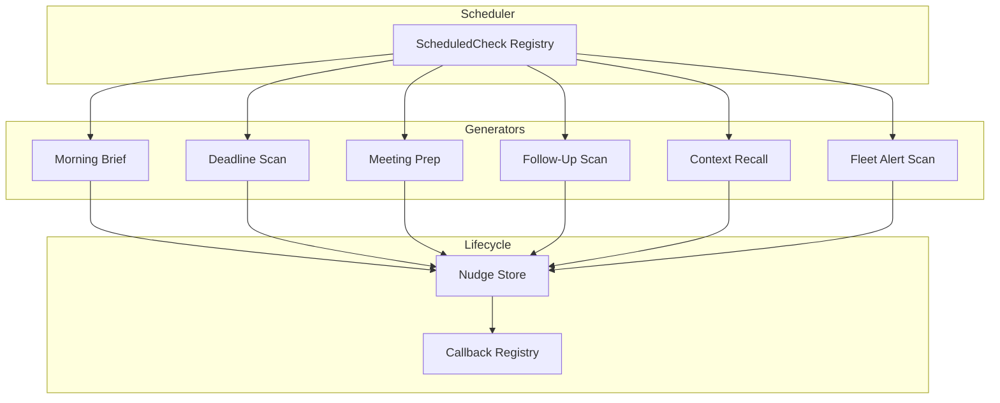

# Proactive Engine Architecture

The Proactive Engine transforms Animus from reactive (wait for user input) to proactive (surface relevant context, warnings, and insights without being asked). It runs scheduled checks against memory and integrations to generate contextual nudges.

## Overview



## Core Abstractions

### Nudge

A `Nudge` (`animus.proactive.Nudge`) is a unit of proactive intelligence:

| Field | Description |
|-------|-------------|
| `id` | UUID |
| `nudge_type` | `MORNING_BRIEF`, `DEADLINE_WARNING`, `MEETING_PREP`, `CONTEXT_RECALL`, `FOLLOW_UP`, `PATTERN_INSIGHT` |
| `priority` | `LOW`, `MEDIUM`, `HIGH`, `URGENT` |
| `title` | Short human-readable headline |
| `content` | Full message body (may be LLM-synthesized) |
| `created_at` | Timestamp |
| `expires_at` | Optional expiration |
| `dismissed` / `acted_on` | Lifecycle flags |
| `source_memory_ids` | Evidence trail — which memories informed this nudge |

### ScheduledCheck

The engine maintains a registry of periodic checks:

| Check Name | Interval | Purpose |
|-----------|----------|---------|
| `deadline_scan` | 60 min | Find upcoming deadlines in memory |
| `follow_up_scan` | 120 min | Detect conversations needing follow-up |
| `context_refresh` | 30 min | Placeholder for on-demand context nudges |
| `fleet_alert_scan` | 5 min | Monitor fleet health and auto-remediate |

## ProactiveEngine API

`ProactiveEngine` lives in `animus.proactive`.

```python
from animus.proactive import ProactiveEngine

engine = ProactiveEngine(
    data_dir=Path.home() / ".animus",
    memory=memory_layer,
    cognitive=cognitive_layer,      # optional: for synthesis
    executor=autonomous_executor,   # optional: for auto-action
)
```

### Background Operation

| Method | Purpose |
|--------|---------|
| `start_background(interval_seconds=300)` | Start daemon thread running scheduled checks every N seconds |
| `stop_background()` | Stop the background loop (graceful, 10s timeout) |
| `is_running` | Property: whether background loop is active |

### Nudge Generation

| Method | Purpose |
|--------|---------|
| `generate_morning_brief()` | Synthesize briefing from last 24h memories + tasks + follow-ups |
| `scan_deadlines()` | Search memory for deadline-related content and emit warnings |
| `prepare_meeting_context(person_or_topic)` | Recall relevant memories about a person or topic |
| `scan_follow_ups()` | Detect "I'll get back to you", "remind me", etc. in recent conversations |
| `generate_context_nudge(user_input)` | Surface related past context during active conversation |
| `scan_fleet_alerts()` | Check `~/.animus/fleet_alerts/` and attempt auto-remediation |

### Nudge Management

| Method | Purpose |
|--------|---------|
| `get_active_nudges()` | All non-dismissed, non-expired nudges |
| `get_nudges_by_type(type)` | Filter by nudge type |
| `get_nudges_by_priority(min_priority)` | Filter to priority level and above |
| `dismiss_nudge(id)` | Mark as dismissed |
| `act_on_nudge(id)` | Mark as acted upon |
| `dismiss_all()` | Dismiss every active nudge |

### Statistics

`get_statistics()` returns:

```python
{
    "total_nudges": int,
    "active_nudges": int,
    "by_type": {"morning_brief": N, "deadline_warning": N, ...},
    "by_priority": {"low": N, "medium": N, ...},
    "background_running": bool,
    "checks": [
        {"name": str, "interval_minutes": int, "last_run": str, "enabled": bool}
    ],
}
```

## Nudge Lifecycle

```
Generated → Stored in _nudges list → Emitted to callbacks →
→ User sees → Dismiss OR Act → Persisted to nudges.json
```

Nudges are persisted to `~/.animus/nudges.json`. The store retains:

- All active nudges
- Last 50 dismissed/acted nudges (for history)

Expired nudges are filtered at query time, not deleted.

## Priority Escalation

Deadline warnings use content-based priority detection:

| Keywords | Priority |
|----------|----------|
| `urgent`, `asap`, `today`, `tomorrow` | `URGENT` |
| `this week`, `soon`, `upcoming` | `HIGH` |
| `deadline` tag present | `MEDIUM` |
| Everything else | `LOW` |

Follow-up priority escalates with age:

| Age | Priority |
|-----|----------|
| ≥ 3 days | `HIGH` |
| < 3 days | `MEDIUM` |

## LLM Synthesis

When a `CognitiveLayer` is provided, the engine synthesizes raw memory snippets into concise, actionable prose. If synthesis fails, the engine falls back to raw bullet points. This keeps the system functional even when the LLM is unavailable.

Synthesis points:

- Morning briefing: 3–5 bullet points focused on today's actions
- Deadline warnings: 1–2 actionable sentences (what's due, what to do)
- Follow-ups: 1–2 sentences on what needs to happen next
- Meeting prep: Summary of prior interactions and last discussed topics
- Context recall: 2–3 sentences of relevant past context

## Fleet Alert Auto-Remediation

The fleet alert scanner (`scan_fleet_alerts`) is unique: it performs automated actions, not just notifications.

1. Read alert context files from `~/.animus/fleet_alerts/*.json`
2. Quick health recheck via HTTP HEAD before running remediation
3. If healthy: auto-resolve task, dismiss alert, emit recovery nudge
4. If still unhealthy: run `fleet_remediate.py` with 120s timeout
5. Emit nudge with remediation result (`RECOVERED` or failure details)

## Integration with Autonomous Executor

When an `AutonomousExecutor` is provided, the engine delegates nudge handling:

```python
if self.executor:
    self.executor.handle_nudge(nudge)
```

This allows the autonomous system to decide whether a nudge warrants automated action (e.g., scheduling a task, sending a message) versus simple notification.

## Configuration

Proactive behavior is controlled via `AnimusConfig`:

```yaml
proactive:
  enabled: true
  background: true
  interval_minutes: 5
```

Environment variables:

| Variable | Effect |
|----------|--------|
| `ANIMUS_PROACTIVE_ENABLED` | Master switch (default: `true`) |
| `ANIMUS_PROACTIVE_BACKGROUND` | Enable background thread (default: `true`) |
| `ANIMUS_PROACTIVE_INTERVAL_MINUTES` | Check interval (default: `5`) |

## Files

| File | Lines | Responsibility |
|------|-------|--------------|
| `animus/proactive.py` | 850 | `ProactiveEngine`, `Nudge`, `ScheduledCheck` |

## CLI Commands

The proactive engine exposes these REPL commands (documented in `reference/cli-commands.md`):

| Command | Action |
|---------|--------|
| `/proactive` | Toggle proactive engine on/off |
| `/proactive status` | Show engine statistics |
| `/proactive brief` | Generate morning briefing now |
| `/proactive dismiss` | Dismiss all active nudges |
| `/proactive scan` | Run all scheduled checks immediately |
| `/proactive meeting <topic>` | Generate meeting prep context |

## Anti-Patterns

- **Don't rely on nudges for time-critical alerts** — Nudges are best-effort; they are not a replacement for proper monitoring/alerting infrastructure.
- **Don't ignore the callback registry** — Callbacks are the primary delivery mechanism. Without registering a callback, nudges are stored but never surfaced.
- **Don't run background scans with interval < 60s** — Memory search is not free. Sub-minute intervals waste CPU for marginal gain.
